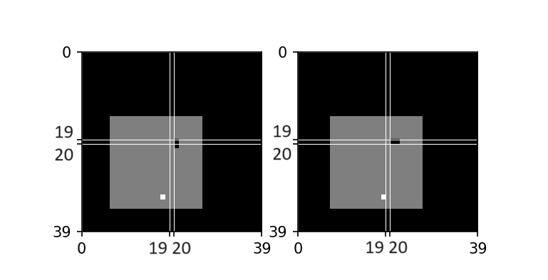

# SnakeRL: Custom Snake AI with Reinforcement Learning

This repository contains a customized implementation of the classic Snake game, designed for reinforcement learning using a convolutional neural network (CNN). The project is built using `gym`, `stable-baselines3`, and `pygame`.

## Video

Watch the Snake AI in action [here](https://youtu.be/KlxuvUgSQRU).


## Overview

The traditional approach to training Snake AI involves moving the snake's head towards the apple. This often results in the snake not learning about its own body and colliding with itself. In this project, the goal is to train the snake to bring the apple (represented as a white square) to the center of the observation space (the snake's head), avoiding collisions with its own body or walls.

## Key Features

- **Custom Reward System**: A new reward system is implemented to encourage the snake to bring the apple to the center.
- **CNN for Observation**: The observation space is a grayscale image where the snake and boundaries are represented by different intensities.
- **Training with Stable Baselines 3**: Training is performed using `stable-baselines3` with custom CNN architecture.
- **MIT License**: The project is open-source under the MIT License.

## Rewards

The reward function is designed to guide the snake towards the goal while penalizing undesirable actions:

- `timeout_penalty = -50`: Penalty for taking too long to eat the apple.
- `dead_penalty = -20`: Penalty for colliding with itself or the wall.
- `food_reward = 10`: Reward for eating the apple.
- `move_penalty = 0`: Neutral reward for regular movement.
- `distance_reward = 0.1`: Reward for reducing the distance between the snake's head and the apple.

## Observation Space

The observation space is a stacked set of two grayscale images, allowing the model to infer the movement direction and make better decisions.



- Observation Space: Grayscale Image 39x39
- `env = VecFrameStack(env, 2, channels_order='last')`

## Hyperparameters

### Initial Hyperparameters

```python
hyperparams = {
    'buffer_size': 100000,
    'learning_rate': 0.0001,
    'batch_size': 32,
    'learning_starts': 100000,
    'target_update_interval': 1000,
    'train_freq': 4,
    'gradient_steps': 1,
    'exploration_fraction': 0.1,
    'exploration_final_eps': 0.01,
    'optimize_memory_usage': False
}
```

### Hyperparameters after 7.6M Steps

```python
learning_rate = 0.00001
batch_size = 128
exploration_final_eps = 0.0001
exploration_fraction = 0.05
train_freq = TrainFreq(frequency=16, unit=TrainFrequencyUnit.STEP)
gradient_steps = 8
target_update_interval = 500
```

# Getting Started

## Prerequisites

Ensure you have the following dependencies installed:

- `gym==0.21.0`
- `pygame`
- `numpy`
- `matplotlib`
- `stable-baselines3==1.7.0`
- `torch` (if training and running inference with GPU, see https://pytorch.org/)

You can install the required packages using the following command:

```bash
pip install gym==0.21.0 pygame numpy matplotlib stable-baselines3==1.7.0 torch
```

## Installation

Clone this repository:


```bash
git clone https://github.com/yourusername/custom-snake-rl.git
```

## Directory Structure

- `snakeRLEnv.py`: Custom gym environment for the Snake game.
- `snakeRL.py`: Implementation of the Snake game logic.
- `trainCustomCNN.py`: Script to train the custom CNN model.
- `loadAndTrainCustomCNN.py`: Script to load and continue training a pre-trained model.
- `testEnv.py`: Script to test the environment sampling the input images.
- `inferenceSnakeRL.py`: Script for inference using a trained model.
- `best_model_17200000.zip`: The last model trained with 17.2M steps.
- `SnakeRL Configs.txt`: Rewards, Observation Space and Hyperparams used to train the model.

## Contributing

Contributions are welcome! If you have any improvements or new features, feel free to open a pull request. Please ensure your changes are well-documented and tested.

## License

This project is licensed under the MIT License. See the [LICENSE](LICENSE) file for more details.

## Acknowledgements

This project is based on the initial implementation by [Patrick Loeber](https://github.com/patrickloeber/snake-ai-pytorch). Special thanks for providing the foundation for this work.
